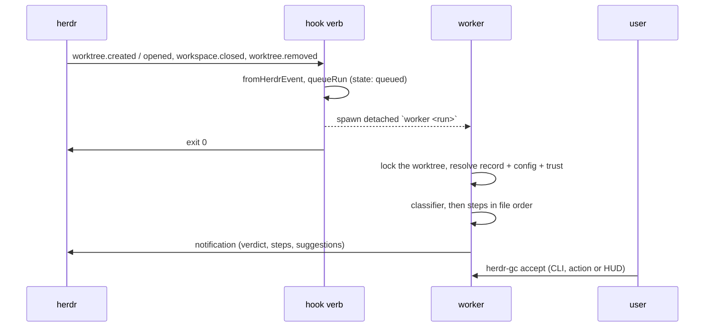

# Architecture

herdr-gc is plain Node ESM with no dependencies and no build step. One CLI,
`bin/herdr-gc`, is the entry point for every herdr hook, action, pane and shell
command. The code under `lib/` splits into I/O modules at the edges and one
pure module, `lib/model.mjs`, in the middle. [design.md](design.md) records
why the design looks like this.

## Module map

| Module | Responsibility |
| --- | --- |
| `bin/herdr-gc` | The CLI and its verbs |
| `lib/env.mjs` | Directories, settings, the herdr binary, the plugin context |
| `lib/toml.mjs` | The strict TOML subset parser |
| `lib/model.mjs` | Pure rules: config, plan, verdicts, events, environment |
| `lib/config.mjs` | Folder discovery, hashing, snapshots, trust |
| `lib/state.mjs` | Records, runs, logs, suggestions, trust entries, locks |
| `lib/exec.mjs` | One command in its own process group |
| `lib/git.mjs` | git facts about a checkout |
| `lib/herdr.mjs` | The herdr CLI: workspaces, notifications, panes |
| `lib/runner.mjs` | The run algorithm, accept, run-step, check, sweep |
| `lib/hud.mjs` | The popup TUI |

## Flow of an event

The hook verb does no slow work. It maps the event, writes a `queued` run
record, and starts `node bin/herdr-gc worker <runId>` detached, with the state
directory as cwd. The worker takes the worktree lock and runs the algorithm
below. Every later step reads the run record, so a worker that dies leaves a
`running` record, and `reconcile` marks it `interrupted`.

## `bin/herdr-gc`

Parses one verb and runs it. The manifest calls the same verbs, so a
keybinding and a shell run the same code. A `[path]` argument resolves to its
checkout. Without a path, the verb uses the checkout of the invoking workspace
from `HERDR_PLUGIN_CONTEXT_JSON`, then the current directory. `--here` always
uses the invoking workspace. Inside herdr, `accept`, `dismiss`, `trust` and
`sweep` also show their result as a notification, because an action has no
terminal. A verb that fails inside herdr shows the error as a notification.

## `lib/model.mjs`

Every rule that needs no I/O:

- `validateConfig` turns a parsed TOML document into a normalized config, or
  throws `ConfigError` with every problem found. Unknown keys are errors.
  `when` needs a classifier for each event of the step.
- `planSteps(config, event, verdict)` gives each step of the event an action:
  `run`, `suggest` or `skip`, with the reason.
- `parseVerdict` implements the classifier protocol. Any failure is `error`.
- `fromHerdrEvent` maps a herdr envelope to an event, or to `{ ignore }`. The
  envelope shapes are the ones herdr 0.9.1 sends; `tests/model.test.mjs` holds
  them.
- `EXPECTS` names the worktree state each event needs: `present` for `create`
  and `open`, `closed` for `close` and `sweep`, `gone` for `remove`.
- `stepEnv` builds the `HERDR_GC_*` environment.

## `lib/config.mjs`

`findConfigDir` walks from the checkout (or its nearest existing parent) up to
the home directory, and falls back to the repo root. `loadConfig` reads every
file of the folder once, refuses symlinks and special files, and hashes the
bytes with the relative path and the executable bit. It writes the same bytes
to `snapshots/<hash>` and parses `config.toml` from them. So the hash, the
parsed config and the snapshot always describe the same content. `isTrusted`
compares the hash with the trust entry of the folder.

## `lib/state.mjs`

All state is files in the plugin state directory:

| Path | Content |
| --- | --- |
| `worktrees/<id>.json` | the record of one checkout path: repo, branch, generation, `removedAt`, last config |
| `runs/<id>.json`, `logs/<id>.log` | one run; the newest 300 stay |
| `suggestions/<id>.json` | one pending suggestion |
| `claimed/` | suggestions that an `accept` or `dismiss` holds |
| `trust/<hash of dir>.json` | the trusted hash of one folder |
| `snapshots/<hash>/` | a hashed folder |
| `locks/<id>.lock` | the pid that holds a worktree |

Every write goes through a temp file and a rename. A lock file is created with
`O_EXCL`. A lock whose pid is dead is taken over through a rename aside, so two
waiters cannot both take it. A claim is a rename from `suggestions/` to
`claimed/`, so exactly one caller gets it.

## `lib/runner.mjs`

### The run algorithm

1. Take the worktree lock. Mark the run `running`.
2. Update the record. A checkout that exists again after its `remove` starts a
   new generation. A gone checkout takes its repo root and branch from the
   record.
3. Check the event against the checkout. `create` and `open` need it present,
   and drop pending `close` and `sweep` suggestions. `close` and `sweep` on a
   gone checkout run nothing and chain `remove`. `remove` needs it gone and
   runs once per generation.
4. Resolve the config. `remove` uses the snapshot recorded before, when the
   folder was inside the deleted checkout. No config ends the run as `done`.
5. An untrusted hash queues one event suggestion, notifies, and ends as
   `blocked`.
6. For `close` and `sweep`, ask herdr which checkouts are open. Leave out the
   closing workspace. Any other one ends the run as `skipped`.
7. Run the classifier, if the event has one.
8. Walk the plan. `suggest` queues a suggestion. `auto` checks herdr again for
   `close` and `sweep`, then runs. A failure stops the rest, unless the step
   has `continue_on_error`.
9. Record the result and notify per `HERDR_GC_NOTIFY`.
10. If the checkout is gone now, chain `remove` under the same lock.

### Accept

`accept` claims the suggestion, then takes the worktree lock. It checks the
state that the event expects; a mismatch drops the suggestion. When herdr does
not answer, the suggestion goes back to the queue. An event suggestion replays
the whole event once the folder is trusted. A step suggestion needs its
snapshot hash still trusted, runs the classifier again for a `when` step, and
runs the step from the snapshot. A deleted checkout chains `remove`.

### Sweep

`sweep` lists the linked worktrees of the repo, leaves out the ones that a
workspace has open, and runs the `sweep` event on each, `HERDR_GC_SWEEP_JOBS`
at a time. `--dry-run` only runs the classifiers and prints the plan.

### Reconcile

`reconcile` marks every `queued` or `running` run whose pid is dead as
`interrupted`. The startup hook and `status` call it. Nothing is replayed.

## `lib/exec.mjs`

`runCommand` runs `/bin/sh -c <command>` detached, as the leader of a new
process group. Output goes to the run log; a foreground CLI run also echoes it.
A classifier's stdout is also captured, up to 64 KiB. A timeout sends SIGTERM
to the group, then SIGKILL after 5 s. Because the group is not the CLI's own,
a Ctrl-C does not reach it. So the CLI traps SIGINT, SIGTERM and SIGHUP and
calls `stopActive`: it signals every active group, refuses new commands, and
the runner ends the run as `interrupted`. The environment drops inherited
`HERDR_PLUGIN_*` and `HERDR_GC_*` variables before `stepEnv` adds its own.

## `lib/hud.mjs`

A raw-ANSI popup in the alternate screen. It reads suggestions and runs every
2 s. `y`, `d` and `t` call `accept`, `dismiss` and `setTrust` after a `y/n`
confirmation where it matters. The HUD adds no operation that the CLI lacks.

## Tests

`tests/fixture.mjs` builds a temp world per test: a git repo with linked
worktrees, private plugin directories, and a fake `herdr` script that answers
`workspace list` from a JSON file and appends notifications to a log. The
runner tests drive the real CLI through it. `tests/examples.test.mjs` runs the
shipped classifier with a fake `gh`. Nothing needs a network, a real herdr or
GitHub.
